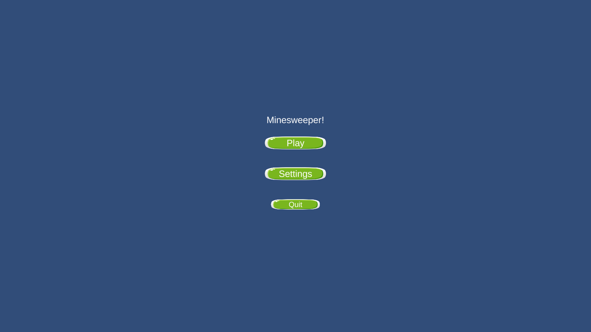
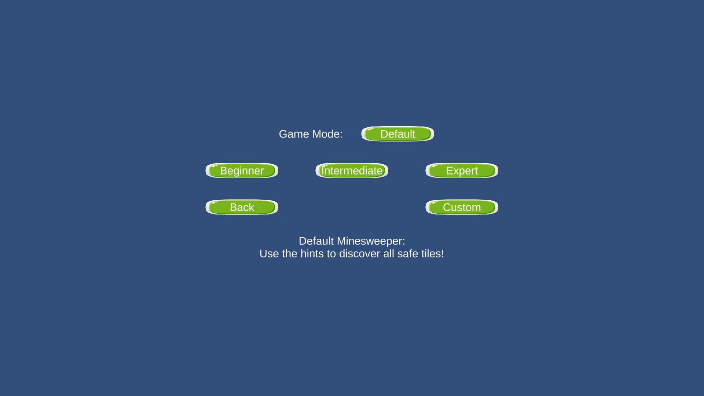
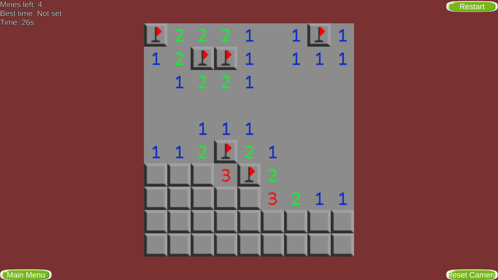

# Minesweeper in Unity

## Description

This project is the first game [Arthur](https://github.com/ArthurChassaing) and I made in Unity. It is a simple Minesweeper game with a few extra game modes. The whole project took 2 weeks to complete.

## How to Play

Once the game is started, the title screen will appear. From there, click "Play" to start a new game. You can also click "Settings" to adjust the game settings.

### Start a game

On the game modes screen, choose the game mode you want to play. Then, click on the difficulty you want to play. The game will start. You can also click on the "Custom" button to create a game with user-defined number of rows, columns and mines.

### Rules

#### Default Game Mode

The default game mode is the classic Minesweeper game. The goal is to uncover all the cells that do not contain a mine. If you uncover a mine, you lose. If you uncover all the cells that do not contain a mine, you win.

When you uncover a cell, a number will appear. This number indicates the number of mines that are adjacent to the cell. If there are no mines adjacent to the cell, all the adjacent cells will be uncovered.

You can place flags on cells that you think contain a mine to help you remember their locations. This is not mandatory to win the game.

The number of mines left (the number of mines minus the number of flags) is displayed at the top left corner of the screen, along with the time elapsed since your first move and your best time for this difficulty.

You can click on the *Restart* button to restart the game with the same settings.

#### Spinning

The spinning game mode is the same as the default game mode, except that the board is slowly rotating.

#### Running Bomb

The running bomb game mode is the same as the default game mode, except that a bomb (always the same) is moving by one cell every time you make a move. The numbers on the cells are updated accordingly.

### Controls

#### Mouse

- **Left click**
    - On a cell: uncover the cell
    - On a flag: do nothing
    - On a number: uncover all the adjacent cells if the number of flags around the cell is equal to the number
- **Right click**
    - On a cell: put down a flag
    - On a flag: remove the flag
    - On a number: do nothing
- **Middle click**: Keep the button pressed and move the mouse to move the camera
- **Scroll wheel**: Zoom in and out

Note: You can also click on the *Reset Camera* button to reset the camera to its default position.

#### Keyboard

- Escape: Instantly quit the game and go back to the title screen. Same as clicking on the *Main Menu* button.

